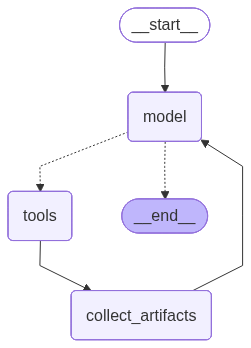

# ai-playground

Playing with different AI Agent Frameworks with Python.

## Setup

**Prerequisites:** Python 3.13+, [uv](https://docs.astral.sh/uv/)

```bash
uv sync
export GROQ_API_KEY=your_key_here
```

## Examples

### `langchain_minimal_example.py`

A minimal LCEL chain using `ChatPromptTemplate`. Demonstrates:

- Building a prompt with system and user messages, including `{placeholders}`
- Composing a chain with the `|` pipe operator: `prompt | llm | StrOutputParser()`
- Invoking the chain with a dict of template variables

```bash
uv run langchain_minimal_example.py
```

### `langchain_create_agent_example.py`

A CLI chat agent built with `create_agent` from LangChain. Demonstrates:

- Defining tools with `@tool` and returning artifacts using `response_format="content_and_artifact"`
- Building an agent that automatically loops over tool calls until it has enough information to respond
- Streaming the final text response token by token while capturing tool results

```bash
uv run langchain_create_agent_example.py
```

### `langchain_rag_example.py`

A small agentic RAG example using local Invincible lore summaries. Demonstrates:

- Modeling source material as LangChain `Document` objects
- Splitting documents with `RecursiveCharacterTextSplitter`
- Retrieving relevant chunks with `BM25Retriever`
- Exposing retrieval as a `search_docs` tool for `create_agent`
- Printing retrieved context and citing source paths in the final answer

```bash
uv run langchain_rag_example.py
```

Try this flow:

```text
why is Omni-Man's role on Earth a problem for Mark?
who is Allen the Alien?
what are the main recurring threats?
```

### `langgraph_agent_example.py`

The same agent built manually with LangGraph, exposing the internals that `create_agent` abstracts away. Demonstrates:

- Defining a custom `AppState` with `add_messages` and `tool_results` to accumulate typed artifacts
- Wiring a `StateGraph` with `model`, `tools`, and `collect_artifacts` nodes
- Using `should_continue` as a conditional edge to implement the tool-calling loop
- Streaming text tokens and reading `tool_results` from the final state using dual `stream_mode=["messages", "values"]`

```bash
uv run langgraph_agent_example.py
```


<div align="center">
  
</div>

To regenerate:

```bash
uv run python -c "
from langgraph_agent_example import graph
with open('assets/langgraph_agent_example.png', 'wb') as f:
    f.write(graph.get_graph().draw_mermaid_png())
"
```


### `langgraph_checkpointer_example.py`

A simple Groq-backed LangGraph chat that preserves conversation state with `InMemorySaver`. Demonstrates:

- Compiling a `StateGraph` with `compile(checkpointer=checkpointer)`
- Accumulating chat messages with `add_messages`
- Continuing a conversation by reusing the same `thread_id`

```bash
uv run langgraph_checkpointer_example.py
```

Try this flow:

```text
my name is Emmanuel
what is my name?
```

### `langmem_memory_store_example.py`

A Groq-backed movie recommendation assistant with LangMem and a LangGraph memory store. Demonstrates:

- Giving the agent LangMem-backed `save_memory` and `search_memories` tools
- Storing long-term movie taste memories in `InMemoryStore`
- Scoping memories by `user_id` with `("memories", "{user_id}")`
- Printing the raw long-term memory store after every turn

```bash
uv run langmem_memory_store_example.py
```

Try this flow:

```text
I like slow-burn sci-fi and I dislike superhero movies
recommend a movie for tonight
```
